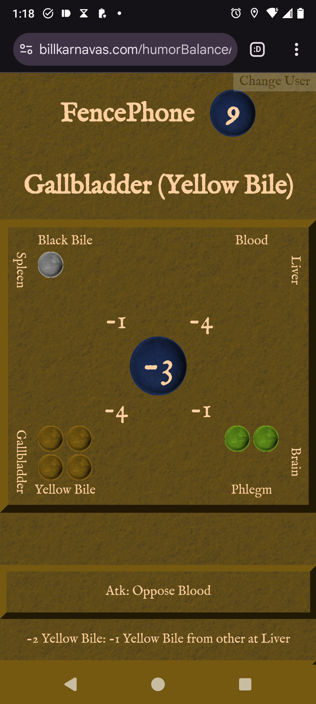
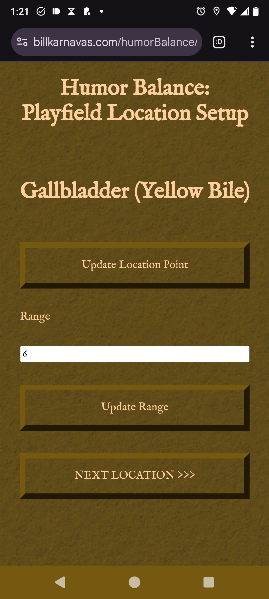
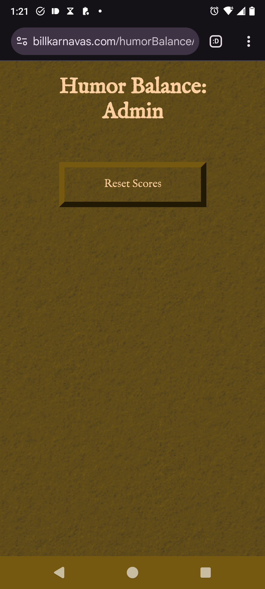

# Humor Balance

Played in the 120x150 foot field around the Self Made Man at UNCC! Run between the four corners of the field, collecting humors to balance your body and attack other players. Once balanced, run to the statue to deposit your points!

> Note that this game is not _exactly_ public and ready to share widely. Game only supports one set of active points and ongoing game in the world at a time.

> The game

> The statue in its field.

## Rules and Description

Players run between locations, competing to score the most points (top blue bubble).

- Center / Statue
  - Automatically begin depositing score
  - When score is deposited, your humors are shuffled and reset, and your current score (middle blue bubble) is added to your full score (top blue bubble).
  - Cannot deposit again until you run to a corner.
- Corners / Four Humors
  - Automatically begin gaining one humor every several seconds
  - Attacks:
    - Oppose attack:
      - Example: attacker in blood. Spend 2 blood to subtract 1 blood from a random player in the yellow bile (opposite) corner.
    - Blood letting attack:
      - Example: attacker in blood. Spend 4 blood to subtract 3 random humors from all other players in same corner as you. (Random choices will exclude blood).

Scoring:

- Every humor is +1 point
- "Imbalance" subtracts points:
  - Ex.: 4 blood, 2 yellow bile: imbalance of 2 for each of them: -4 points.
- Scores range from -8 to 16.

## Link to play

https://billkarnavas.com/humorBalance/

## How to set up and play

You will need a space at least 60' by 60', preferably much more, to play, due to lag and inaccuracy of phone GPS sensors.

### Place Points of Field

https://billkarnavas.com/humorBalance/fieldSetup/

Move to each point of the field and place them by using the buttons on this page. Range is in meters, and is how close players must be measured to the point to count as being there. To play a responsive game, remember that there will be lag as players run to the point! That means the range that feels good is larger than you would expect, as the lagging phone GPS position will enter the point later than the physical player.

### Reset Current Game

https://billkarnavas.com/humorBalance/learderboardAdmin/

Reset scores wipes the active players and all player scores. Effectively starts a new game.

## Architecture

Game is a website.

- 3 static webpages: game, location setup, admin.
  - These are statically hosted on a Linode server through Caddy.
- 1 [PocketBase](https://pocketbase.io/) instance
  - Coordinates game through 3 collections, which can be accessed with get, update, delete commands and a "live updates" feature.
  - Collections:
    - humor_balance_attacks:
      - Each attack is added here
      - All players pages subscribed for live updates
      - When target player sees attack, deletes message in humor_balance_attacks and applies attack
    - humor_balance_locations
      - 5 locations of game saved here
      - All players pages subscribed, so that if these locations change, changes do apply across players immediately
    - humor_balance_players
      - Stores players past and present. Saves scores, and lets players see where each other are. Persists player state through page reloads
      - Players default to active = false, and become active through interacting
    - humor_balance_resets
      - Message-bus style collection where player pages subscribe, and after game is reset, all player pages refresh.